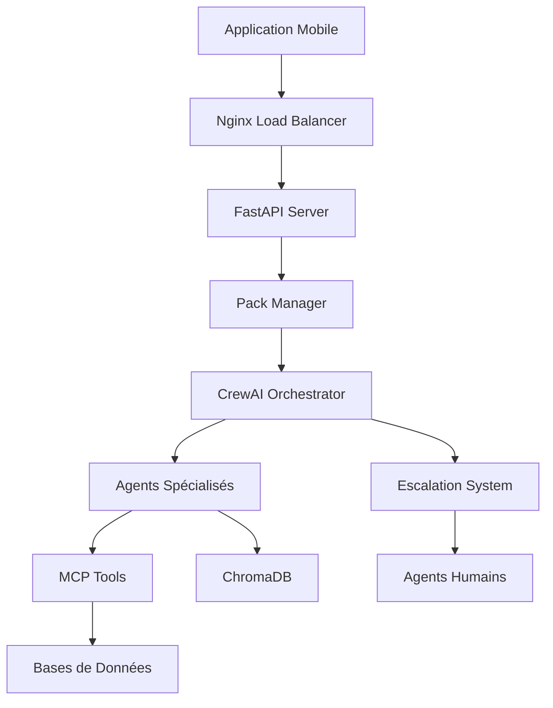

# Architecture Système - Coris Intelligent Assistant

## Vue d'ensemble

Le Coris Intelligent Assistant est un système multi-agents basé sur CrewAI, conçu pour fournir une assistance intelligente aux utilisateurs des applications Coris Money et d'autres applications futures.

## Composants Principaux

### 1. Core System

- **Pack Manager** : Gestion des niveaux de service par filiale
- **MCP Server** : Serveur de protocole de contexte de modèle
- **ChromaDB Multi-Tenant** : Base de connaissances vectorielle
- **Conversation Manager** : Gestion des sessions et historique
- **Escalation System** : Système d'escalade intelligente

### 2. Agent Framework (CrewAI)

- **Core Agents** : Agents réutilisables (service client, escalade)
- **Application Agents** : Agents spécifiques (Coris Money, futures apps)
- **Task Orchestration** : Coordination des tâches entre agents
- **Dynamic Routing** : Routage intelligent selon le contexte

### 3. Data Layer

- **PostgreSQL Conversations** : Historique des échanges
- **PostgreSQL DataWarehouse** : Données transactionnelles (existant)
- **PostgreSQL Réclamations** : Gestion des réclamations (existant)
- **ChromaDB Collections** : Une collection par application/filiale

### 4. API Layer

- **REST API** : Interface pour applications mobiles
- **Webhook System** : Notifications push
- **Authentication** : Gestion des clés API et JWT
- **Rate Limiting** : Protection contre le spam

## Flux de Données

